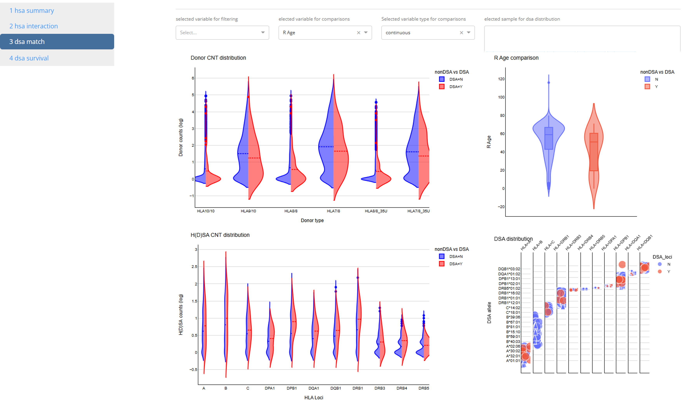

# This APP is intend to have a convenient way for H(D)SA explotory data analyses
## Introduction

The 1st page is the high level summary of HSA distributions with demographic variables in this 4k cohort.

The 2nd page is the detailed analyses on 4 ways interactions of demographic variables on HSA distribution.

The 3rd page is the exploratory analyses of HLA matching characteristics between transplants with and without DSA. 

The 4th page is udner construction for potential transplant outcome analyses regarding DSA status.
